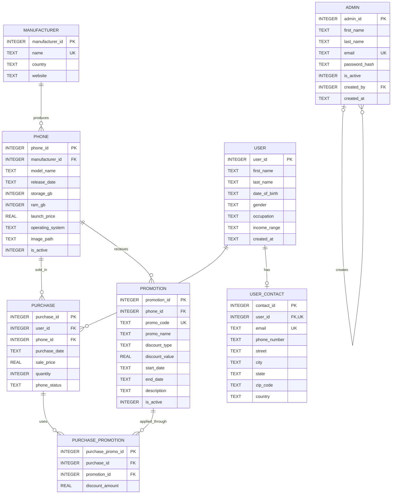

# Smartphone Sales Dashboard

A public interview-demo dashboard backed by FastAPI, SQLAlchemy, and SQLite, with a Vite/React analytics frontend.

## Database design



Key relationship rules:

- A manufacturer can have many phone configurations; each phone belongs to one manufacturer.
- A customer can make many purchases and can have at most one contact record.
- `purchase_promotion` resolves the many-to-many relationship between purchases and promotions. A unique constraint prevents duplicate promotion assignments, and a trigger limits each purchase to two promotions.
- Promotions belong to a specific phone, while purchases record the customer, phone, quantity, sale price, and device status at the time of sale.
- Administrators have a self-referencing creator relationship. The root administrator has `created_by = NULL`.

## First-time setup

### Backend environment

```bash
cd backend
python3 -m venv .venv
source .venv/bin/activate
pip install -r requirements.txt
cp .env.example .env
python -c "import secrets; print(secrets.token_urlsafe(48))"
```

Paste the generated value after `JWT_SECRET=` in `backend/.env`. The local `.env` file is ignored by Git.

Create the first administrator interactively:

```bash
python scripts/create_admin.py
```

The script securely prompts for the password and stores only its bcrypt hash. Once a root admin exists, create additional admins from the protected Admins page.

### Frontend environment

```bash
cd ../frontend
npm install
```

## Run locally

Open two terminal windows from the project root.

### Backend

```bash
cd backend
source .venv/bin/activate
uvicorn app.main:app --reload
```

### Frontend

```bash
cd frontend
npm install
npm run dev
```

Then open:

- Public dashboard: http://127.0.0.1:5173
- Admin login: http://127.0.0.1:5173/#/admin/login
- Backend: http://127.0.0.1:8000
- Swagger API docs: http://127.0.0.1:8000/docs

The frontend uses `http://127.0.0.1:8000` by default. To use another backend, set `VITE_API_BASE_URL` before starting Vite.
